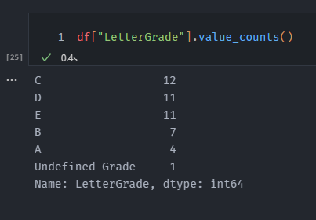

# Lab 1 - Data

The intention behind this lab is that you will get familiar with the process of reading a dataset, and exploring the data a little through the pandas framework

**Pandas documentation:** https://pandas.pydata.org/docs/

You are done with this lab when you have managed to display a values counts of the data like so

## Hints

- Inspect the data for outliers or missing data with pandas functionality

- the `.info()` and `.describe()` dataframe functions can help you a lot with finding outliers in data

- The teacher might have forgotten to fill out all the grades! (Deal with Nan Values)
  - Use the `.isna()` and `.dropna()` functions to help with cleaning the data

In the pandas documentation 